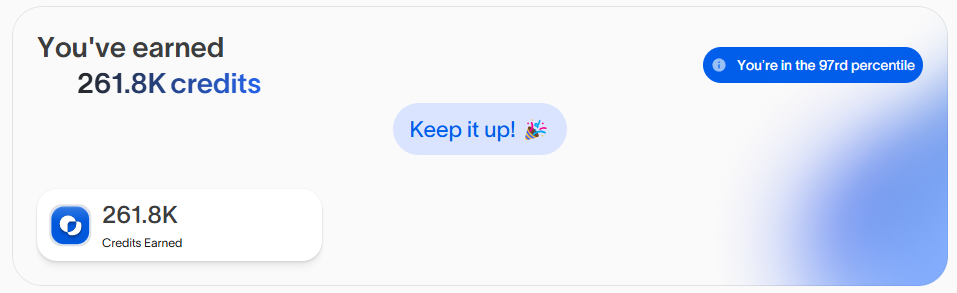

# OASIS AI BETA CLI VERSION
## Register: [Oasis AI](https://r.oasis.ai/8f588b172fe7f193)
# Buy Proxies
- Free Proxies Static Residental: 
1. [WebShare](https://www.webshare.io/?referral_code=ic9d4taithna)
2. [ProxyScrape](https://proxyscrape.com/?ref=odk1mmj)
3. [MonoSans](https://github.com/monosans/proxy-list)
- Paid Premium Static Residental:
1. [922proxy](https://www.922proxy.com/register?inviter_code=cebe9133)
2. [Proxy-Cheap](https://app.proxy-cheap.com/r/OhWwGe)
3. [Infatica](https://dashboard.infatica.io/aff.php?aff=544)


AI inference powered by distributed compute

# Features



- **Register/Login Accounts**

- **Auto Create Providers**

- **Auto Send Heartbeat**

- **Support Multy Accounts**

- **Support Proxy**

## Requirements

- **Node.js**: Ensure you have Node.js installed.

- **NPM**: Ensure you have npm installed.

put your proxy in file `proxy.txt` format `http://username:pass@ip:port` 1 proxy for 1 provider

so if you want create multiple providers you need to put multiple proxy there.

## Setup

1. Clone this repository:

   ```bash
   git clone https://github.com/CryptoAirdropHindi/oasis-bot.git
   cd oasis-bot
   ```

2. Install dependencies:

   ```bash
   npm install
   ```

3. put your email and pass to `accounts.txt` format `email|password` 1 account for 1 line

   ```bash
   nano accounts.txt
   ```

4. put your proxy to `proxy.txt`

   ```bash
   nano proxy.txt
   ```

5. Setup to create accounts/login and get Tokens:

   ```bash
   npm run setup
   ```

6. Run The Script:

   ```bash
   npm run start
   ```

## Additional feature auto refferal
   ```bash
   npm run autoreff
   ```
# Notes
- Run this bot, and it will update your referrer code to my invite code if you don't have one.
- One account only can connect with 10 Proxies.
- Feel free to enjoy and recode or create new bots using the Oasis API with direct IP that I found.
- You can just run this bot at your own risk, I'm not responsible for any loss or damage caused by this bot. This bot is for educational purposes only.
